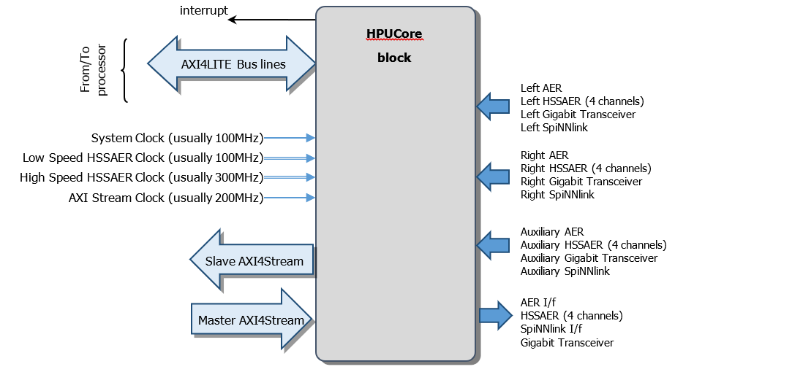
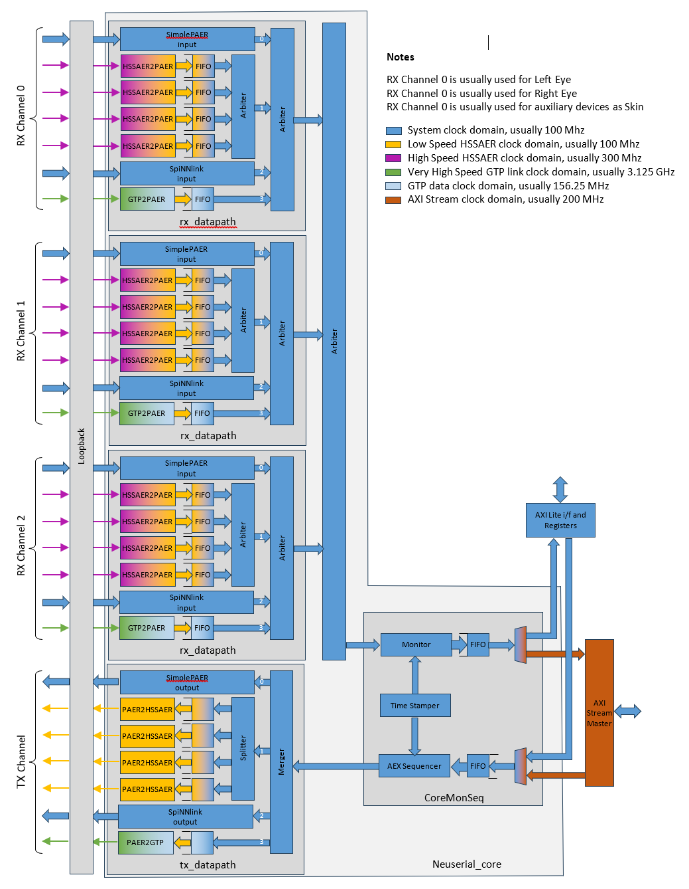

# HPU_Core
The **Head Processor Unit Core (HPU Core)** is an AXI peripheral used to manage different input AER or SpiNNlink streaming and transfer the acquired data into memory through DMA interface or by reading registers with Host CPU.
It is also Transmission capable, and permits to send AER or SpiNNlink streaming to external devices.

## Block Diagram
In the following figure the Block Diagram of the _HPU Core_

## HPU_Core Linux driver
Please, note that depending on platform, the HPU Linux driver needs the following kernel:

UZCB  
https://gitlab.iit.it/edl/linux-kernel-zynqmp/tree/UZCB-2021.1  
  
ZCB  
https://github.com/andreamerello/linux-zynq-stable/tree/P2018_17_SPINNAKER

